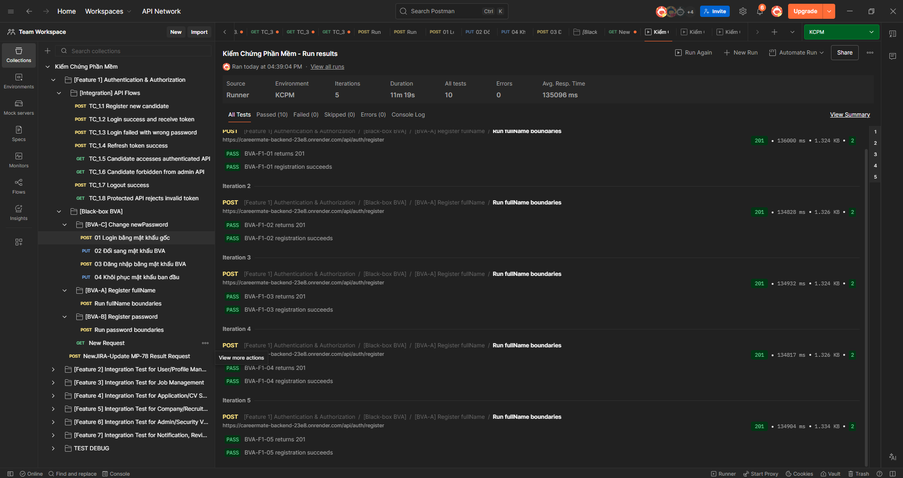
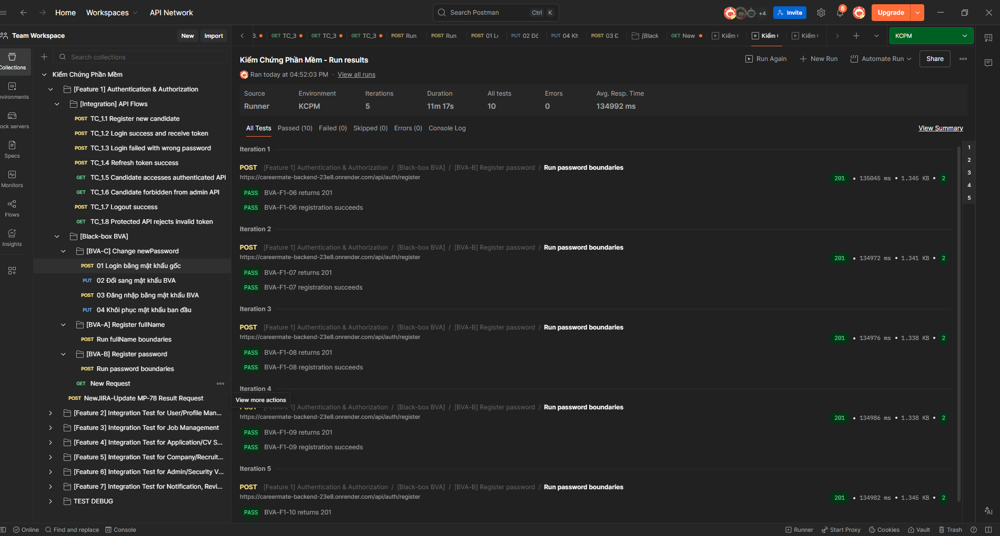
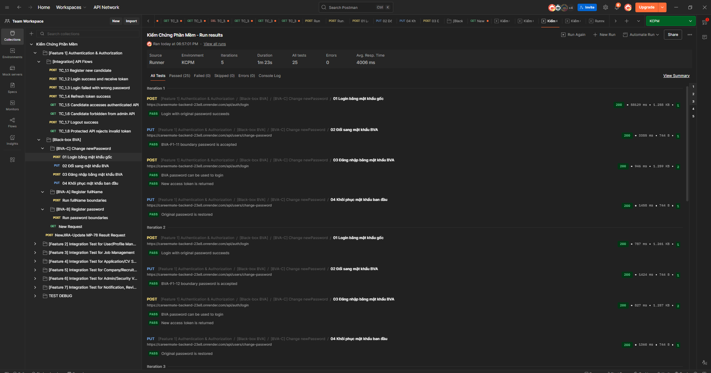
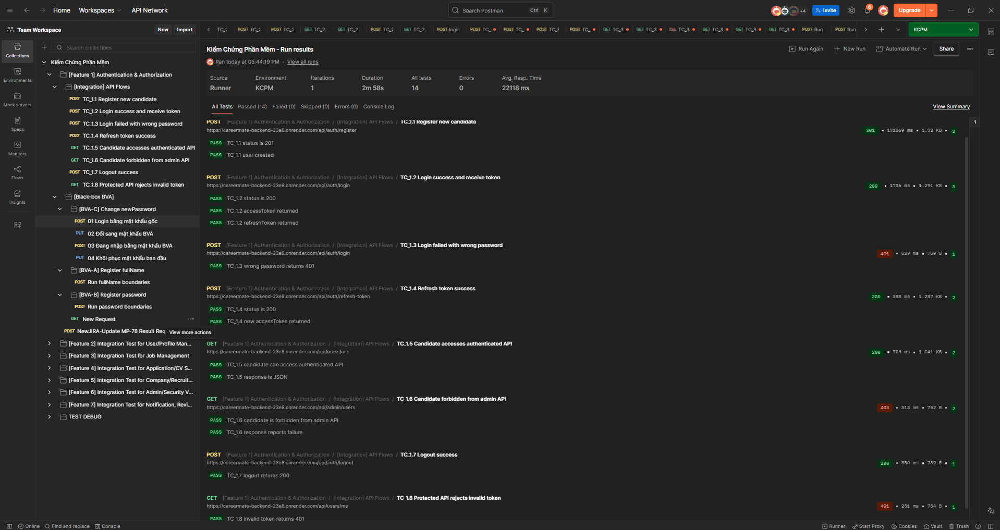
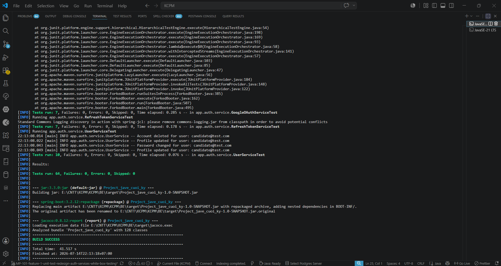
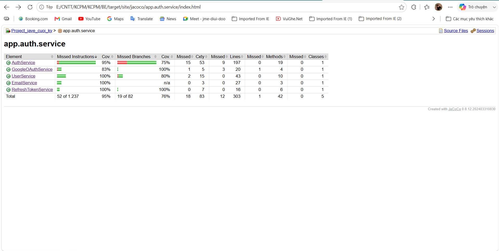

# Assignment: Kiểm thử Feature 1 - Xác thực và Bảo mật

**Chủ đề:** Phân hoạch lớp tương đương, phân tích giá trị biên, kiểm thử Black-box, kiểm thử White-box và đo lường độ bao phủ  
**Môn học:** Kiểm chứng phần mềm  
**Dự án áp dụng:** CareerMate  
**Feature:** F1 - Authentication & Authorization  
**Người phụ trách:** Lê Minh Đức  
**Jira:** `MP-101 - [Feature 1] Unit Test Redesign - Auth Services White-box Testing`  
**Nhánh Git:** `MP-101-feature-1-unit-test-redesign-auth-services-white-box-testing`  
**Ngày cập nhật:** 17/07/2026

---

## 1. Mục tiêu bài kiểm thử

1. Xác định đúng phạm vi nghiệp vụ của Feature 1 từ source code CareerMate.
2. Áp dụng **phân hoạch lớp tương đương (EP)** và **phân tích giá trị biên (BVA)** cho dữ liệu đầu vào.
3. Kiểm thử **Black-box** các luồng API mà không phụ thuộc vào cấu trúc code bên trong.
4. Kiểm thử **White-box** năm service bằng JUnit 5 và Mockito, tập trung vào nhánh thành công, nhánh lỗi và dependency.
5. Đo Line, Branch, Method và Class Coverage bằng JaCoCo.
6. Tách riêng kết quả Black-box, White-box và BVA để không cộng nhầm số test hoặc suy diễn sai độ bao phủ.

---

## 2. Mô tả bài toán kiểm thử

Feature 1 quản lý đăng ký, xác thực email, đăng nhập local/Google, token, khôi phục mật khẩu và thông tin tài khoản. Phạm vi White-box gồm đúng năm service thật trong package `app.auth.service`:

| Service ID | Production class | Chức năng chính | Test class |
|---|---|---|---|
| `F1-S01` | `AuthService` | Đăng ký, xác thực, đăng nhập, Google OAuth, token, quên/đặt lại mật khẩu | `AuthServiceTest` |
| `F1-S02` | `EmailService` | Gửi email xác thực và email reset mật khẩu | `EmailServiceTest` |
| `F1-S03` | `GoogleOAuthService` | Xác minh Google ID token | `GoogleOAuthServiceTest` |
| `F1-S04` | `RefreshTokenService` | Tạo, tìm, kiểm tra và thu hồi refresh token | `RefreshTokenServiceTest` |
| `F1-S05` | `UserService` | Lấy/cập nhật tài khoản, đổi mật khẩu, xóa tài khoản | `UserServiceTest` |

### 2.1. Phân biệt ba phạm vi quan trọng

| Kỹ thuật | Đối tượng quan sát | Có biết code bên trong? | Bằng chứng chính | Số lượng hiện tại |
|---|---|---:|---|---:|
| **BVA/EP** | Biến và miền đầu vào của DTO/API | Không bắt buộc | Bảng lớp tương đương, bộ giá trị biên, Postman Runner | 15/15 BVA Pass; không cộng vào 64 service test |
| **Black-box Integration** | Luồng request-response qua API | Không | Postman request, status code, response body | 8 luồng |
| **White-box Unit Test** | Method, nhánh `if/else`, exception, dependency của service | Có | JUnit/Mockito và JaCoCo | 64 lượt test |

> **Quy tắc thống kê:** 64 lượt test là White-box Unit Test của năm service. Chúng không được dùng để tự động kết luận rằng Bean Validation/BVA đã được bao phủ, vì Unit Test service không tải Spring MVC và không tự kích hoạt annotation validation của DTO.

---

## 3. Giả định và giới hạn

1. Ràng buộc đầu vào lấy trực tiếp từ annotation trong các DTO hiện tại, không sao chép giả định `8-16` của file mẫu.
2. Service Unit Test dùng service thật và mock repository/dependency; không dùng database thật, API thật hay toàn bộ Spring Context.
3. Black-box Integration Test dùng endpoint deploy và tài khoản test đã được xác thực.
4. `JwtTokenProviderTest`, `JwtAuthenticationFilterTest` và `CustomUserDetailsServiceTest` không nằm trong bộ năm service của MP-101.
5. JaCoCo được tổng hợp riêng cho package `app.auth.service` sau khi chạy đúng năm test class.

---

# PHẦN A. THIẾT KẾ BLACK-BOX, EP VÀ BVA

## 4. Phân hoạch lớp tương đương

| Biến/trạng thái | Lớp hợp lệ | Tag | Lớp không hợp lệ | Tag |
|---|---|---|---|---|
| Email đăng ký | Đúng định dạng, không rỗng, dài không quá 100, chưa tồn tại | `EP-V01` | Null/rỗng; sai định dạng; trên 100 ký tự; đã tồn tại | `EP-X01` - `EP-X04` |
| Họ tên | Chuỗi 2-100 ký tự | `EP-V02` | Null/rỗng; dưới 2; trên 100 | `EP-X05` - `EP-X07` |
| Mật khẩu | 6-50 ký tự, có chữ hoa, chữ thường và chữ số | `EP-V03` | Null/rỗng; ngoài 6-50; thiếu một nhóm ký tự | `EP-X08` - `EP-X10` |
| Role đăng ký | `CANDIDATE` hoặc `RECRUITER` | `EP-V04` | Null; tự đăng ký `ADMIN` | `EP-X11`, `EP-X12` |
| Trạng thái tài khoản | `ACTIVE`, đã xác thực và không bị cấm | `EP-V05` | `PENDING`, chưa xác thực hoặc `BANNED` | `EP-X13` - `EP-X15` |
| Mã xác thực email | Khớp mã đang lưu của user chưa xác thực | `EP-V06` | Null/sai; user không tồn tại; user đã xác thực | `EP-X16` - `EP-X18` |
| Google token | Verifier chấp nhận và trả payload | `EP-V07` | Null/rỗng; malformed; verifier trả null/ném lỗi | `EP-X19` - `EP-X22` |
| Refresh token | Tồn tại và chưa hết hạn | `EP-V08` | Không tồn tại; đã hết hạn | `EP-X23`, `EP-X24` |
| Reset token | Tồn tại, chưa dùng, chưa hết hạn | `EP-V09` | Không tồn tại; đã dùng; hết hạn | `EP-X25` - `EP-X27` |
| Avatar | Không có file hoặc file upload thành công | `EP-V10` | Upload dependency ném lỗi | `EP-X28` |
| Cập nhật profile | Giá trị mới khác null và không blank | `EP-V11` | Null/blank thì giữ nguyên giá trị cũ | `EP-X29` |
| Mật khẩu cũ | Encoder xác nhận khớp | `EP-V12` | Không khớp | `EP-X30` |

### 4.1. Ý nghĩa đối với Black-box

- Mỗi lớp hợp lệ chỉ cần đại diện bởi ít nhất một dữ liệu hợp lệ.
- Mỗi lớp không hợp lệ cần một test để chứng minh hệ thống từ chối đúng cách.
- Không cần thử mọi chuỗi có thể có; các giá trị trong cùng lớp được kỳ vọng có hành vi tương đương.
- Các trạng thái nghiệp vụ như `BANNED`, `PENDING`, token hết hạn là lớp tương đương, không phải giá trị biên số học.

---

## 5. Phân tích giá trị biên (BVA)

### 5.1. Nguồn xác định biên

| DTO/field | Ràng buộc trong code | Biên hợp lệ |
|---|---|---|
| `RegisterRequest.fullName` | `@Size(min = 2, max = 100)` | 2-100 ký tự |
| `RegisterRequest.email` | `@NotBlank`, `@Email`, `@Size(max = 100)` | Đúng email và tối đa 100 ký tự |
| `RegisterRequest.password` | `@Size(min = 6, max = 50)`, `@Pattern` | 6-50 ký tự và đúng độ phức tạp |
| `ResetPasswordRequest.newPassword` | `@Size(min = 6, max = 50)`, `@Pattern` | 6-50 ký tự và đúng độ phức tạp |
| `ChangePasswordRequest.newPassword` | `@Size(min = 6, max = 50)`, `@Pattern` | 6-50 ký tự và đúng độ phức tạp |

`ResetPasswordRequest.token` chỉ có `@NotBlank`, không có `@Size` hoặc `@Pattern`; do đó không được tự gán biên 6 ký tự như file mẫu.

### 5.2. Bộ giá trị Standard BVA

Báo cáo sử dụng **Standard Boundary Value Analysis**, gồm đúng năm điểm `min`, `min+`, `nominal`, `max-`, `max`. Không sử dụng `min-` và `max+` của Robust BVA.

| Biến | min | min+ | nominal | max- | max |
|---|---:|---:|---:|---:|---:|
| Độ dài `fullName` | 2 | 3 | 50 | 99 | 100 |
| Độ dài `password` | 6 | 7 | 28 | 49 | 50 |
| Độ dài `newPassword` | 6 | 7 | 28 | 49 | 50 |

Với password, chuỗi tại cả năm điểm vẫn phải chứa ít nhất một chữ hoa, một chữ thường và một chữ số. Nếu không, test sẽ đồng thời vi phạm `@Pattern` và không còn cô lập biến độ dài.

`email` chỉ có `@Size(max = 100)` mà không có biên dưới số học ngoài `@NotBlank`. Vì vậy email được kiểm tra bằng lớp tương đương hợp lệ/không hợp lệ và không được ép thành một biến Standard BVA đủ năm điểm.

### 5.3. Bảng test BVA rút gọn

Để không tạo quá nhiều method lặp lại, 15 dòng dữ liệu dưới đây nên được cài đặt bằng ba `@ParameterizedTest`, mỗi field một method.

| ID | Field | Giá trị/độ dài | Kỳ vọng | Kết quả | Tag |
|---|---|---:|---|---|---|
| `BVA-F1-01` | `fullName` | 2 | Accept | Pass | `NAME-min` |
| `BVA-F1-02` | `fullName` | 3 | Accept | Pass | `NAME-min+` |
| `BVA-F1-03` | `fullName` | 50 | Accept | Pass | `NAME-nominal` |
| `BVA-F1-04` | `fullName` | 99 | Accept | Pass | `NAME-max-` |
| `BVA-F1-05` | `fullName` | 100 | Accept | Pass | `NAME-max` |
| `BVA-F1-06` | `password` | 6 | Accept | Pass | `PWD-min` |
| `BVA-F1-07` | `password` | 7 | Accept | Pass | `PWD-min+` |
| `BVA-F1-08` | `password` | 28 | Accept | Pass | `PWD-nominal` |
| `BVA-F1-09` | `password` | 49 | Accept | Pass | `PWD-max-` |
| `BVA-F1-10` | `password` | 50 | Accept | Pass | `PWD-max` |
| `BVA-F1-11` | `newPassword` | 6 | Accept | Pass | `NEW-min` |
| `BVA-F1-12` | `newPassword` | 7 | Accept | Pass | `NEW-min+` |
| `BVA-F1-13` | `newPassword` | 28 | Accept | Pass | `NEW-nominal` |
| `BVA-F1-14` | `newPassword` | 49 | Accept | Pass | `NEW-max-` |
| `BVA-F1-15` | `newPassword` | 50 | Accept | Pass | `NEW-max` |

**Trạng thái BVA:** Đã chạy tự động bằng Postman Runner trên API deploy. Cả 15/15 trường hợp Standard BVA đều Pass. Kết quả này được quản lý riêng và không cộng vào 64 White-box Unit Test.

### 5.4. Minh chứng thực thi BVA

Ba bộ dữ liệu BVA được chạy độc lập bằng Postman Collection Runner:

- **BVA-A - `fullName`:** 5 iteration, 10/10 assertion Pass, 0 Fail, 0 Error.



- **BVA-B - `password`:** 5 iteration, 10/10 assertion Pass, 0 Fail, 0 Error.



- **BVA-C - `newPassword`:** chuỗi bốn request được chạy với 5 iteration tương ứng các độ dài 6, 7, 28, 49 và 50; 25/25 assertion Pass, 0 Fail, 0 Error.



> Tổng cộng có 15 bộ dữ liệu Standard BVA và 45/45 assertion Postman Pass. Số assertion lớn hơn số test case vì một test case có thể kiểm tra đồng thời HTTP status và nội dung response.

---

## 6. Thiết kế Black-box Integration Test

Black-box chỉ quan sát input, HTTP status và response. Người test không cần biết repository hoặc nhánh code bên trong.

| ID | Luồng/Endpoint | Pre-condition | Procedure tóm tắt | Expected result | Kết quả ghi nhận |
|---|---|---|---|---|---|
| `IT-F1-01` | `POST /api/auth/register` | Email mới | Gửi body Candidate hợp lệ | `201 Created`, tạo user và yêu cầu xác thực | Pass |
| `IT-F1-02` | `POST /api/auth/login` | Candidate đã xác thực | Gửi email/mật khẩu đúng | `200 OK`, trả access và refresh token | Pass |
| `IT-F1-03` | `POST /api/auth/login` | User tồn tại | Gửi sai mật khẩu | `401 Unauthorized` | Pass |
| `IT-F1-04` | `POST /api/auth/refresh-token` | Refresh token hợp lệ | Gửi refresh token đã nhận | Trả access token mới | Pass |
| `IT-F1-05` | `GET /api/users/me` | Candidate token hợp lệ | Gửi Bearer token | `200 OK`, trả profile | Pass |
| `IT-F1-06` | `GET /api/admin/users` | Candidate token hợp lệ | Dùng Candidate token gọi API chỉ dành cho Admin | `403 Forbidden` | Pass sau khi cập nhật token đúng môi trường |
| `IT-F1-07` | `POST /api/auth/logout` | User đã đăng nhập | Gửi yêu cầu logout | `200 OK`, refresh token bị thu hồi | Pass |
| `IT-F1-08` | `GET /api/users/me` | Không có hoặc token sai | Gửi request không có Bearer hợp lệ | `401 Unauthorized` | Pass |

### 6.1. Tiêu chí đánh giá Black-box

1. Request phải dùng environment và token cùng một backend; token cũ từ backend khác có thể tạo kết quả sai.
2. `401` dùng cho thiếu/sai xác thực; `403` dùng cho token hợp lệ nhưng sai quyền.
3. Evidence nên gồm request URL/method, request body đã che mật khẩu, status, response và thời gian chạy.
4. Kết quả Black-box không thay thế Branch Coverage; một API trả 200 không chứng minh mọi nhánh service đã được chạy.

### 6.2. Minh chứng thực thi Integration API

Tám luồng Integration được chạy tuần tự trên API deploy bằng Postman Runner. Kết quả ghi nhận **14/14 assertion Pass, 0 Fail, 0 Error**. Trong đó `IT-F1-06` trả đúng `403 Forbidden` và `IT-F1-08` trả đúng `401 Unauthorized`.



---

# PHẦN B. KIỂM THỬ WHITE-BOX VÀ ĐỘ BAO PHỦ

## 7. Static Review / Code Audit và xác định nhánh

Đây là phần **kiểm thử tĩnh (Static Review/Code Audit)** của Feature 1. Nhóm đọc trực tiếp năm production service, không chạy chương trình, để xác định contract, validation, exception, role và dependency cần mock trước khi thiết kế Unit Test. Chỉ các method thực sự tồn tại trong source code được đưa vào phạm vi.

### 7.1. Ma trận Code Audit

| Class | Method | Input chính | Output/side effect | Validation và decision | Exception cần kiểm tra | Role | Dependency |
|---|---|---|---|---|---|---|---|
| `AuthService` | `register()` | `RegisterRequest`, avatar tùy chọn | `AuthResponse`, lưu User, có thể tạo Company | Email trùng; cấm ADMIN; avatar có/không; upload thành công/lỗi; Candidate/Recruiter | Email đã tồn tại; role không hợp lệ | Candidate, Recruiter | `UserRepository`, `CompanyRepository`, `PasswordEncoder`, `CloudinaryService`, `EmailService` |
| `AuthService` | `verifyEmail()` | Email, verification code | Kích hoạt và lưu User | User có/không; đã xác minh/chưa; code đúng/sai | Không tìm thấy User; đã xác minh; code sai | User chưa xác minh | `UserRepository` |
| `AuthService` | `resendVerificationCode()` | Email | Sinh code mới và gửi email | User có/không; trạng thái pending/đã xác minh | Không tìm thấy User; tài khoản đã xác minh | User chưa xác minh | `UserRepository`, `EmailService` |
| `AuthService` | `login()` | `LoginRequest` | Access token, refresh token, thông tin User | Credentials; email verified; banned; maintenance; ADMIN/non-ADMIN | Sai xác thực; chưa xác minh; bị khóa; maintenance | Candidate, Recruiter, Admin | `AuthenticationManager`, `UserRepository`, `JwtTokenProvider`, `RefreshTokenService`, `SystemSettingService` |
| `AuthService` | `googleAuth()` | `GoogleAuthRequest` | Tạo/cập nhật User và trả token | User mới/cũ; Google ID thiếu/có; banned; Candidate/Recruiter | Google token/User không hợp lệ; tài khoản bị khóa | Candidate, Recruiter | `GoogleOAuthService`, `UserRepository`, `CompanyRepository`, token services |
| `AuthService` | `refreshToken()` | `RefreshTokenRequest` | Access token mới | Token tìm thấy/không; còn hạn/hết hạn | Token không tồn tại hoặc hết hạn | User đã đăng nhập | `RefreshTokenService`, `JwtTokenProvider` |
| `AuthService` | `logout()` | Email | Xóa refresh token | User tồn tại/không | Không tìm thấy User | User đã đăng nhập | `UserRepository`, `RefreshTokenService` |
| `AuthService` | `forgotPassword()` | Email | Tạo reset token và gửi email | Email tồn tại/không | Không tìm thấy User | Public | `UserRepository`, `PasswordResetTokenRepository`, `EmailService` |
| `AuthService` | `resetPassword()` | Reset token, mật khẩu mới | Đổi mật khẩu, đánh dấu token đã dùng | Token tồn tại; đã dùng; còn hạn | Token sai, đã dùng hoặc hết hạn | Public có reset token | `PasswordResetTokenRepository`, `PasswordEncoder`, `UserRepository` |
| `EmailService` | `sendVerificationEmail()` | Email, code | Tạo và gửi MIME message | Dữ liệu hợp lệ; mail dependency thành công/thất bại | Exception từ mail sender được service bắt và ghi log | N/A | `JavaMailSender` |
| `EmailService` | `sendResetPasswordEmail()` | Email, token | Tạo và gửi reset-password email | Dữ liệu hợp lệ; mail dependency thành công/thất bại | Exception từ mail sender được service bắt và ghi log | N/A | `JavaMailSender` |
| `GoogleOAuthService` | `verifyGoogleToken()` | Google ID token | `Map` thông tin Google user | Token null/rỗng/malformed; verifier trả payload/null | `InvalidTokenException`; lỗi verifier được bọc lại | Google user | `GoogleIdTokenVerifier` |
| `RefreshTokenService` | `createRefreshToken()` | User | Refresh token được lưu | Expiry phải ở tương lai | Lỗi repository nếu có | User | `RefreshTokenRepository` |
| `RefreshTokenService` | `verifyExpiration()` | Refresh token | Trả token hợp lệ hoặc xóa token | Expiry trước/sau thời điểm hiện tại | Token hết hạn | User | `RefreshTokenRepository`, hệ thống thời gian |
| `RefreshTokenService` | `findByToken()` | Token string | Refresh token | Repository có/không có dữ liệu | Token không tồn tại | User | `RefreshTokenRepository` |
| `RefreshTokenService` | `deleteByUser()`, `deleteExpiredTokens()` | User hoặc thời điểm hiện tại | Xóa token | Đúng User; đúng mốc thời gian | Lỗi repository nếu có | User/System job | `RefreshTokenRepository` |
| `UserService` | `getCurrentUser()` | Principal hiện tại | `UserResponse` | User tồn tại/không | Không tìm thấy User | Authenticated user | `UserRepository`, security context |
| `UserService` | `updateProfile()` | Full name, image URL | Lưu và trả profile mới | Input có giá trị so với null/blank | Không tìm thấy User | Authenticated user | `UserRepository` |
| `UserService` | `changePassword()` | Old/new password | Lưu password mới, thu hồi token | Old password đúng/sai | Không tìm thấy User; mật khẩu cũ sai | Authenticated user | `UserRepository`, `PasswordEncoder`, `RefreshTokenService` |
| `UserService` | `deleteAccount()` | Principal hiện tại | Thu hồi token và xóa User | User tồn tại/không | Không tìm thấy User | Authenticated user | `UserRepository`, `RefreshTokenService` |

### 7.2. Kết quả Audit

- Phạm vi production code: **5 service class, 21 public method** (không tính helper/lambda do compiler tạo).
- Điểm rủi ro cao: xác thực trạng thái tài khoản, token hết hạn, role/maintenance, reset password và dependency ngoại vi Google/Email.
- Kết quả Audit là đầu vào trực tiếp cho Test Condition tại mục 8 và ma trận Unit Test tại mục 10; đây không phải kết quả test động và không cộng vào số lượng 64 lượt Unit Test.

---

## 8. Test Condition White-box

| Nhóm | Test Condition chính | Test ID liên quan | Nhánh dự kiến |
|---|---|---|---|
| Register | Tạo Candidate/Recruiter, trùng email, role ADMIN, avatar và upload error | `UT-F1-001` - `UT-F1-014` | True/False của các decision trong `register()` |
| Verification | Code đúng/sai, email không tồn tại, đã verified, resend | `UT-F1-003`, `004`, `015` - `019` | User/status/code |
| Login | Đúng/sai credentials, unverified, banned, maintenance, Admin | `UT-F1-006`, `007`, `020` - `024` | Authentication/status/role |
| Google Auth | User mới/cũ, banned, Recruiter | `UT-F1-025` - `028` | Optional user/status/role |
| Token/password | Refresh, logout, forgot/reset password | `UT-F1-005`, `008`, `009`, `029` - `036` | Token/user/time/used |
| Email dependency | Gửi thành công và exception | `UT-F1-037` - `040` | Try/catch |
| Google verifier | Invalid data, valid payload, null, IOException | `UT-F1-041` - `047` | Verifier result/exception |
| Refresh token service | Create, expiration, find, delete | `UT-F1-048` - `054` | Time/Optional |
| User service | Current user, profile, password, delete | `UT-F1-055` - `064` | User/field/password |

---

## 9. Triển khai Unit Test tự động

### 9.1. Nguyên tắc

- JUnit 5 và Mockito.
- Service thật; repository và dependency được mock.
- Không dùng database thật, API endpoint thật hoặc toàn bộ Spring Context.
- Mỗi test có assertion hoặc `verify()` rõ ràng.
- Cấu trúc Arrange - Act - Assert.
- Mỗi production service có một test class tương ứng.

Ví dụ cấu trúc:

```java
@ExtendWith(MockitoExtension.class)
class RefreshTokenServiceTest {
    @Mock
    private RefreshTokenRepository refreshTokenRepository;

    @InjectMocks
    private RefreshTokenService refreshTokenService;

    @Test
    void verifyExpiration_shouldDeleteAndThrow_whenTokenIsExpired() {
        // Arrange
        // Act + Assert
        // Verify repository interaction
    }
}
```

### 9.2. Vị trí test

```text
BE/src/test/java/app/auth/service/AuthServiceTest.java
BE/src/test/java/app/auth/service/EmailServiceTest.java
BE/src/test/java/app/auth/service/GoogleOAuthServiceTest.java
BE/src/test/java/app/auth/service/RefreshTokenServiceTest.java
BE/src/test/java/app/auth/service/UserServiceTest.java
```

### 9.3. Lệnh chạy

Chạy tại `E:\CNTT\KCPM\KCPM\BE`:

```bat
mvn clean verify -Pcoverage "-Dtest=AuthServiceTest,EmailServiceTest,GoogleOAuthServiceTest,RefreshTokenServiceTest,UserServiceTest"
```

Kết quả:

```text
Tests run: 64
Failures: 0
Errors: 0
Skipped: 0
BUILD SUCCESS
```

### 9.4. Minh chứng thực thi Unit Test

Ảnh terminal dưới đây ghi nhận đủ **64 test, 0 Failure, 0 Error, 0 Skipped** và Maven `BUILD SUCCESS`. Phần stack trace ở phía trên ảnh là log của trường hợp exception được test chủ động; nó không phải lỗi làm thất bại quá trình build.



---

## 10. Danh sách 64 lượt White-box Unit Test

### 10.0. Ma trận thiết kế Unit Test chi tiết

| Test class / phạm vi | Test ID | Arrange và dependency mock | Act | Expected result / assertion | Nhánh được bao phủ |
|---|---|---|---|---|---|
| `AuthServiceTest.register()` | `UT-F1-001`, `002`, `010` - `014` | Mock email chưa tồn tại/trùng; role; avatar null/có; Cloudinary success/exception | Gọi `register()` | Tạo User đúng role/default; từ chối email trùng/ADMIN; dùng URL upload hoặc avatar mặc định; tạo Company cho Recruiter | Email true/false; ADMIN true/false; avatar true/false; upload success/catch; Candidate/Recruiter |
| `AuthServiceTest.verify/resend` | `UT-F1-003`, `004`, `015` - `019` | Mock Optional User rỗng/có; verified flag; verification code | Gọi `verifyEmail()` hoặc `resendVerificationCode()` | Lưu trạng thái verified hoặc ném đúng exception; gửi code mới khi pending | User found; verified; code match; resend allowed |
| `AuthServiceTest.login()` | `UT-F1-006`, `007`, `020` - `024` | Mock authentication success/failure; User verified/banned; maintenance flag; role | Gọi `login()` | Trả token khi hợp lệ; từ chối sai mật khẩu, missing User, unverified, banned; chỉ Admin qua maintenance | Authentication; status; banned; maintenance; ADMIN/non-ADMIN |
| `AuthServiceTest.googleAuth()` | `UT-F1-025` - `028` | Mock Google payload; User mới/cũ; Google ID; banned; role | Gọi `googleAuth()` | Tạo/cập nhật User, tạo Company cho Recruiter hoặc ném exception khi banned | Existing/new User; Google ID; banned; Candidate/Recruiter |
| `AuthServiceTest.token/password` | `UT-F1-005`, `008`, `009`, `029` - `036` | Mock refresh/reset token hợp lệ, thiếu, hết hạn, đã dùng; User có/không | Gọi refresh/logout/forgot/reset | Trả access token mới, xóa token, gửi email hoặc ném đúng exception; password được encode khi reset hợp lệ | Token found/expiry/used; User found; success/exception |
| `EmailServiceTest` | `UT-F1-037` - `040` | Mock `JavaMailSender` và MIME message; success hoặc dependency exception | Gửi verification/reset email | `send()` được gọi với message đúng; exception được service xử lý theo contract | Normal path và catch path của hai method |
| `GoogleOAuthServiceTest` | `UT-F1-041` - `047` | Mock verifier với null, empty, malformed, valid payload, null result, `IOException` | Gọi `verifyGoogleToken()` | Trả đủ Google user fields hoặc ném `InvalidTokenException` có message phù hợp | Input invalid; verifier success/null/exception |
| `RefreshTokenServiceTest` | `UT-F1-048` - `054` | Mock repository; expiry tương lai/quá khứ; Optional có/rỗng | Create, verify, find và delete token | Lưu token đúng expiry; trả token hợp lệ; xóa và ném khi hết hạn; delegate đúng repository | Time boundary; Optional present/empty; delete paths |
| `UserServiceTest` | `UT-F1-055` - `064` | Mock current User có/rỗng; input profile đầy đủ/null/blank; password match/mismatch | Get/update/change/delete User | Trả DTO, chỉ cập nhật field hợp lệ, encode password, thu hồi token và xóa User hoặc ném exception | User found; field present/blank; password match; delete success/failure |

Danh sách dưới đây là ánh xạ một-một giữa mỗi lượt JUnit được Maven thực thi và Test ID dùng trong báo cáo. Với `ParameterizedTest`, mỗi bộ dữ liệu được tính là một lượt test riêng.

### 10.1. AuthServiceTest - 36 lượt

| ID | Test method/tình huống | Result |
|---|---|---|
| `UT-F1-001` | `register_shouldCreateUser_whenEmailNotExists` | Pass |
| `UT-F1-002` | `register_shouldThrowException_whenEmailAlreadyExists` | Pass |
| `UT-F1-003` | `verifyEmail_shouldActivateUser_whenCodeIsCorrect` | Pass |
| `UT-F1-004` | `verifyEmail_shouldThrowException_whenCodeIsWrong` | Pass |
| `UT-F1-005` | `logout_shouldDeleteRefreshTokenByUser` | Pass |
| `UT-F1-006` | `login_shouldReturnToken_whenCredentialsAreValid` | Pass |
| `UT-F1-007` | `login_shouldThrowException_whenPasswordIsWrong` | Pass |
| `UT-F1-008` | `refreshToken_shouldReturnNewAccessToken_whenRefreshTokenIsValid` | Pass |
| `UT-F1-009` | `forgotPassword_shouldCreateResetTokenAndSendEmail_whenEmailExists` | Pass |
| `UT-F1-010` | `register_shouldThrowException_whenRoleIsAdmin` | Pass |
| `UT-F1-011` | `register_shouldUseDefaultAvatar_whenAvatarIsNotProvided` | Pass |
| `UT-F1-012` | `register_shouldUploadAvatar_whenAvatarIsProvided` | Pass |
| `UT-F1-013` | `register_shouldUseDefaultAvatar_whenAvatarUploadFails` | Pass |
| `UT-F1-014` | `register_shouldCreateDefaultCompany_whenRecruiterRegisters` | Pass |
| `UT-F1-015` | `verifyEmail_shouldThrowException_whenEmailNotFound` | Pass |
| `UT-F1-016` | `verifyEmail_shouldThrowException_whenAccountAlreadyVerified` | Pass |
| `UT-F1-017` | `resendVerification_shouldSendNewCode_whenUserIsPending` | Pass |
| `UT-F1-018` | `resendVerification_shouldThrowException_whenEmailNotFound` | Pass |
| `UT-F1-019` | `resendVerification_shouldThrowException_whenAccountAlreadyVerified` | Pass |
| `UT-F1-020` | `login_shouldThrowException_whenEmailNotFoundAfterAuthentication` | Pass |
| `UT-F1-021` | `login_shouldThrowException_whenEmailIsNotVerified` | Pass |
| `UT-F1-022` | `login_shouldThrowException_whenUserIsBanned` | Pass |
| `UT-F1-023` | `login_shouldThrowMaintenanceModeException_whenNonAdminLogsInDuringMaintenance` | Pass |
| `UT-F1-024` | `login_shouldAllowAdmin_whenMaintenanceEnabled` | Pass |
| `UT-F1-025` | `googleAuth_shouldCreateNewCandidate_whenEmailNotExists` | Pass |
| `UT-F1-026` | `googleAuth_shouldUpdateExistingUser_whenGoogleIdIsMissing` | Pass |
| `UT-F1-027` | `googleAuth_shouldThrowException_whenExistingUserIsBanned` | Pass |
| `UT-F1-028` | `googleAuth_shouldCreateDefaultCompany_whenNewRecruiterLogsIn` | Pass |
| `UT-F1-029` | `refreshToken_shouldThrowException_whenTokenIsInvalid` | Pass |
| `UT-F1-030` | `refreshToken_shouldThrowException_whenTokenIsExpired` | Pass |
| `UT-F1-031` | `logout_shouldThrowException_whenEmailNotFound` | Pass |
| `UT-F1-032` | `forgotPassword_shouldThrowException_whenEmailNotFound` | Pass |
| `UT-F1-033` | `resetPassword_shouldUpdatePassword_whenTokenIsValid` | Pass |
| `UT-F1-034` | `resetPassword_shouldThrowException_whenTokenIsInvalid` | Pass |
| `UT-F1-035` | `resetPassword_shouldThrowException_whenTokenWasUsed` | Pass |
| `UT-F1-036` | `resetPassword_shouldThrowException_whenTokenIsExpired` | Pass |

### 10.2. EmailServiceTest - 4 lượt

| ID | Test method | Result |
|---|---|---|
| `UT-F1-037` | `sendVerificationEmail_shouldCreateAndSendMessage_whenInputIsValid` | Pass |
| `UT-F1-038` | `sendVerificationEmail_shouldSwallowException_whenMailCreationFails` | Pass |
| `UT-F1-039` | `sendResetPasswordEmail_shouldCreateAndSendMessage_whenInputIsValid` | Pass |
| `UT-F1-040` | `sendResetPasswordEmail_shouldSwallowException_whenMailCreationFails` | Pass |

### 10.3. GoogleOAuthServiceTest - 7 lượt

| ID | Test method/dữ liệu | Result |
|---|---|---|
| `UT-F1-041` | `verifyGoogleToken_shouldThrow_whenTokenIsInvalid [null]` | Pass |
| `UT-F1-042` | `verifyGoogleToken_shouldThrow_whenTokenIsInvalid [empty]` | Pass |
| `UT-F1-043` | `verifyGoogleToken_shouldThrow_whenTokenIsInvalid [not-a-google-id-token]` | Pass |
| `UT-F1-044` | `verifyGoogleToken_shouldThrow_whenTokenIsInvalid [a.b.c]` | Pass |
| `UT-F1-045` | `verifyGoogleToken_shouldReturnUserInfo_whenTokenIsValid` | Pass |
| `UT-F1-046` | `verifyGoogleToken_shouldThrow_whenVerifierReturnsNull` | Pass |
| `UT-F1-047` | `verifyGoogleToken_shouldWrapException_whenVerificationFails` | Pass |

### 10.4. RefreshTokenServiceTest - 7 lượt

| ID | Test method | Result |
|---|---|---|
| `UT-F1-048` | `createRefreshToken_shouldSaveTokenWithUserAndFutureExpiry` | Pass |
| `UT-F1-049` | `verifyExpiration_shouldReturnSameToken_whenTokenIsValid` | Pass |
| `UT-F1-050` | `verifyExpiration_shouldDeleteAndThrow_whenTokenIsExpired` | Pass |
| `UT-F1-051` | `findByToken_shouldReturnToken_whenTokenExists` | Pass |
| `UT-F1-052` | `findByToken_shouldThrow_whenTokenDoesNotExist` | Pass |
| `UT-F1-053` | `deleteByUser_shouldDelegateToRepository` | Pass |
| `UT-F1-054` | `deleteExpiredTokens_shouldUseCurrentTime` | Pass |

### 10.5. UserServiceTest - 10 lượt

| ID | Test method | Result |
|---|---|---|
| `UT-F1-055` | `getCurrentUser_shouldReturnResponse_whenUserExists` | Pass |
| `UT-F1-056` | `getCurrentUser_shouldThrow_whenUserDoesNotExist` | Pass |
| `UT-F1-057` | `updateProfile_shouldUpdateProvidedFieldsAndSave` | Pass |
| `UT-F1-058` | `updateProfile_shouldKeepExistingFields_whenInputsAreBlankOrNull` | Pass |
| `UT-F1-059` | `updateProfile_shouldThrow_whenUserDoesNotExist` | Pass |
| `UT-F1-060` | `changePassword_shouldEncodeSaveAndRevokeTokens_whenOldPasswordMatches` | Pass |
| `UT-F1-061` | `changePassword_shouldThrow_whenOldPasswordDoesNotMatch` | Pass |
| `UT-F1-062` | `changePassword_shouldThrow_whenUserDoesNotExist` | Pass |
| `UT-F1-063` | `deleteAccount_shouldRevokeTokensAndDeleteUser_whenUserExists` | Pass |
| `UT-F1-064` | `deleteAccount_shouldThrow_whenUserDoesNotExist` | Pass |

---

## 11. Báo cáo White-box bằng JaCoCo

### 11.1. Kết quả tổng hợp

| Chỉ số | Covered/Total | Tỷ lệ | Mục tiêu | Đánh giá |
|---|---:|---:|---:|---|
| Instruction Coverage | `1.185/1.237` | 95% | Tham khảo | Tốt |
| Line Coverage | `291/303` | 96,0% | >= 80% | Đạt |
| Branch Coverage | `63/82` | 76,8% | >= 70% | Đạt |
| Method Coverage | `41/42` | 97,6% | >= 80% | Đạt |
| Class Coverage | `5/5` | 100% | 100% | Đạt |

### 11.2. Kết quả theo service

| Service | Line Coverage | Branch Coverage | Method Coverage | Đánh giá |
|---|---:|---:|---:|---|
| `AuthService` | 95,4% (`188/197`) | 75% (`51/68`) | 100% (`19/19`) | Đạt |
| `GoogleOAuthService` | 85% (`17/20`) | 100% (`2/2`) | 75% (`3/4`) | Đạt logic nghiệp vụ |
| `UserService` | 100% (`43/43`) | 80% (`8/10`) | 100% (`10/10`) | Đạt |
| `EmailService` | 100% (`27/27`) | N/A | 100% (`3/3`) | Đạt |
| `RefreshTokenService` | 100% (`16/16`) | 100% (`2/2`) | 100% (`6/6`) | Đạt |

### 11.3. Phân tích nhánh chưa phủ

- `AuthService` còn 17/68 nhánh chưa phủ, chủ yếu nằm trong các biểu thức điều kiện kết hợp và fallback ít xảy ra.
- `UserService` còn 2/10 nhánh chưa phủ trong logic cập nhật field.
- `GoogleOAuthService.verifyGoogleToken()` đạt 100% Line và 100% Branch; `createVerifier()` không chạy vì test thay verifier bằng mock để không gọi Google thật.
- Branch Coverage 76,8% đạt mục tiêu 70%, nhưng không đồng nghĩa mọi requirement Black-box đều Pass.

### 11.4. Cải tiến sau lần đo đầu

Ban đầu `GoogleOAuthService` chỉ có các token invalid, Line Coverage thấp và Branch Coverage 0%. Sau khi tách `createVerifier()` và mock verifier, bộ test bổ sung:

1. Token hợp lệ và payload đầy đủ.
2. Verifier trả `null`.
3. Verifier ném `IOException`.

Kết quả: `GoogleOAuthService` đạt 85% Line và 100% Branch; tổng test tăng từ 61 lên 64.

Báo cáo HTML:

```text
BE/target/site/jacoco/index.html
```

### 11.5. Minh chứng báo cáo JaCoCo

Ảnh tổng hợp package `app.auth.service` cho thấy năm service đều được đo; tổng Instruction Coverage đạt 95% và Branch Coverage hiển thị làm tròn là 76% (giá trị chi tiết `63/82 = 76,8%`).



---

# PHẦN C. NHẬT KÝ LỖI, MINH CHỨNG VÀ TỔNG KẾT

## 12. Nhật ký lỗi Feature 1

Không ghi nhận bug thuộc Feature 1 trong phạm vi kiểm thử hiện tại.

---
## 13. Tài liệu có thể tái thực thi

- [Postman Feature 1 Collection](postman/feature-1.postman_collection.json)
- [BVA fullName data](postman/bva-fullname.csv)
- [BVA password data](postman/bva-password.csv)
- [BVA newPassword data](postman/bva-new-password.csv)

---

## 14. Tổng kết

| Hạng mục | Kết quả |
|---|---|
| Production service | 5 |
| White-box test class | 5 |
| White-box Unit Test | 64/64 Pass |
| Black-box Integration flow | 8/8 luồng, 14/14 assertion Pass |
| BVA | 15/15 Standard BVA, 45/45 assertion Pass; không cộng vào 64 Unit Test |
| JaCoCo Line Coverage | 96,0% - Đạt |
| JaCoCo Branch Coverage | 76,8% - Đạt |
| JaCoCo Method Coverage | 97,6% - Đạt |
| JaCoCo Class Coverage | 100% - Đạt |

Kết luận:

- **Black-box** xác nhận các luồng API và phân biệt đúng `401 Unauthorized` với `403 Forbidden`.
- **BVA** được xây dựng từ ràng buộc thật `2-100`, `max 100` và `6-50`; không tái sử dụng biên `8-16` của dự án mẫu.
- **White-box** dùng 64 lượt JUnit/Mockito để bao phủ các nhánh nội bộ của năm service.
- JaCoCo xác nhận mục tiêu Line và Branch Coverage đều đạt, nhưng BVA và Black-box vẫn có bằng chứng riêng và không được thay thế bằng tỷ lệ coverage.
